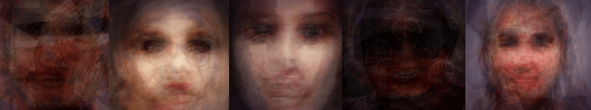

# Selected Works

- [Self Directed / Experimental](#self-directed--experimental)
    - [Medusae](#medusae)
    - [[Dinild] Trimp](#dinild-trimp)
    - [Faces](#faces)
    - [Illuminator](#illuminator)
    - [Polyselfie](#polyselfie)
    - [Particulate](#particulate)
    - [Water Underground](#water-underground)
- [Client / Contract](#client--contract)
    - [Destroy Ernie's Evidence](#destroy-ernies-evidence)

## Self Directed / Experimental

### Medusae

> _Soft body jellyfish simulation_  
> _2015_  
> [Live Project](https://jayweeks.com/medusae/) – [Source Code](https://github.com/jpweeks/particulate-medusae/) – [Process Gallery](https://www.flickr.com/photos/jpweeks/albums/72157646887502644)

Starting out as a few simple prototypes to test a realtime physics system I was working on, this project became a bit of an obsession for me as I tinkered with constraints and designed various components of jellyfish anatomy. Being a physically based simulation, minimal input (a user can tap/click the hood to emit a nudging force, and the hood muscles are continuously expanding and contracting) results in complex organic movement which can be quite mesmerizing. As a technical aside, all geometry and physical constraints are procedurally generated through hand-coded methods, which was fairly tedious. In future work, I hope to develop tools for automating or graphically editing simulation constraints to allow quicker iteration on ideas with a balance between creative freedom and technical tedium, making this process more accessible to others as well as my future self.

### [Dinild] Trimp

> _Surrealist horror voodoo doll; nonsensical phrase generator_  
> _2016_  
> [Live Project](https://jayweeks.com/trimp/) – [3D Model](https://sketchfab.com/models/c4f36edae1034348bc8c22eb8837cca4) – [Source Code](https://github.com/jpweeks/dinild-trimp/) – [Process Gallery](https://www.flickr.com/photos/jpweeks/albums/72157675071532004)

Spawned in response to (and named after) a [Tumblr stream](http://dinild.tumblr.com) featuring strangely grotesque photo composites, this piece provides a novel interface for generating nonsensical phrases: through interaction with a digital entity conceptually similar to a voodoo doll. Each selection is made by inserting a crystalline needle into the surface of the doll head, creating a string of short phrases over time in order of insertion. Although based on a political figure, I see this experience as an abstract commentary on control and manipulation, as well as an  auditory/visual exploration of the grotesque. My initial aim was to develop a system capable of synthesizing arbitrary words and phrases from a limited set of predefined sounds and their corresponding mouth shapes; the final piece is more limited, with predefined words composed of a limited set of primary mouth shapes with accompanying audio. It would be interesting to apply machine learning methodologies to blend mouth shapes based on input syllables; although I currently have limited knowledge of this field, I hope to explore it more as the technology becomes more accessible.  

### Faces

> _Strange face compositions generated with computer vision_  
> _2017_  
> [Live Project](https://jayweeks.com/faces/) – [Source Code](https://github.com/jpweeks/faces) – [Composite Gallery](https://www.flickr.com/photos/jpweeks/albums/72157685408940515)

### Illuminator (WIP)

> _Interactive kinetic sculpture concept_  
> _2017_  
> [3D Model](https://sketchfab.com/models/87c1fd50cf054247a89fbc2932e770c2) – [Process Gallery](https://www.flickr.com/photos/jpweeks/albums/72157678782827834)

### Polyselfie

> _Polygonal webcam toy_  
> _2013_  
> [Live Project](https://jayweeks.com/polyselfie/) – [Source Code](https://github.com/jpweeks/polyselfie/)

### Particulate

> _Particle physics micro library_  
> _2014_  
> [Live Project](https://particulatejs.org) – [Source Code](https://github.com/jpweeks/particulate-js/)

### Water Underground

> _Global ground water data visualization_  
> _2011_  
> [Live Project](https://jayweeks.com/water-underground/) – [Source Code](https://github.com/jpweeks/water-underground/)

## Client / Contract

### Destroy Ernie's Evidence

> _Immersive eight-chapter whodunit with hidden games_  
> _[The Wonderful Company](https://www.wonderful.com)_  
> _2017_  
> _[Backbone][backbone-url], [Pixi][pixi-url], [Grunt][grunt-url], WebGL, GLSL_  
> [Live Project](http://helpernie.com)  

An immersive eight-chapter whodunit with hidden games where users help Ernie the Elephant track down the missing “nature film” he made with the Squirrel Sisters.

Working with one other frontend developer, I was responsible for establishing the site's architecture and build system as well as leading graphics development and our device responsiveness strategy. Core site features I built include the home page intro, each chapter's interactive panorama scene with hidden clues, games for chapters (2, 4, 6, 7, 8), as well as the campaign finale sequence.

[backbone-url]: http://backbonejs.org
[pixi-url]: http://www.pixijs.com
[grunt-url]: https://gruntjs.com
