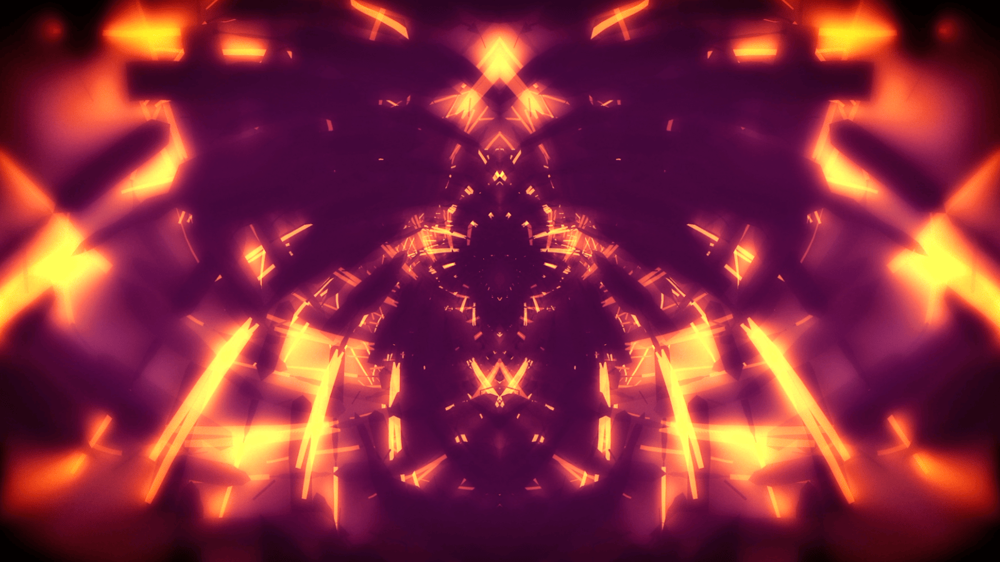

# Selected Works

- [Self Directed / Experimental](#self-directed--experimental)
    - [Microbium](#microbium)
    - [Medusae](#medusae)
    - [[Dinild] Trimp](#dinild-trimp)
    - [Faces](#faces)
    - [Illuminator](#illuminator)
    - [Polyselfie](#polyselfie)
    - [Particulate](#particulate)
    - [Water Underground](#water-underground)
- [Client / Contract](#client--contract)
    - [Sam Smith Diamonds](#sam-smith-diamonds)
    - [Bastille Doom Days House](#bastille-doom-days-house)
    - [Destroy Ernie's Evidence](#destroy-ernies-evidence)

## Self Directed / Experimental

### Microbium

> _Playful sandbox app for simulation based generative art_  
> _2018-2022_  
> [App Promo Site](https://microbiumapp.com) – [Live Sketches](https://codepen.io/collection/AWpRYr/) – [Process Gallery](https://www.instagram.com/explore/tags/microbiumapp/) – [GitHub Universe Showcase](https://www.youtube.com/watch?v=XRV0yRLiC1g)

Not quite a serious tool yet much more than just a toy, Microbium intends to be a fun and friendly sandbox for experimentation with simulation based generative art. Designed for simplicity, you will only need to learn one polygon / brush tool to start making interesting art, while much depth in style and motion can be achieved with the flexible rendering and simulating systems. My initial motivation for this project started with a [Jellyfish](#medusae); people really enjoy observing the mesmerizing movements of these forms. This was an experimental project to test some of my ideas for simulation based animation, but the process was very limiting: I had hand-coded procedures for generating and connecting all the parts and components of the form. I wanted a fun tool and better process for myself and for others to experiment more freely, so Microbium came to be.

### Medusae

> _Soft body jellyfish simulation_  
> _2015_  
> [Live Project](https://milcktoast.com/medusae/) – [Source Code](https://github.com/milcktoast/particulate-medusae/) – [Process Gallery](https://www.flickr.com/photos/jpweeks/albums/72157646887502644)

Starting out as a few simple prototypes to test a realtime physics system I was working on, this project became a bit of an obsession for me as I tinkered with constraints and designed various components of jellyfish anatomy. Being a physically based simulation, minimal input (a user can tap/click the hood to emit a nudging force, and the hood muscles are continuously expanding and contracting) results in complex organic movement which can be quite mesmerizing. As a technical aside, all geometry and physical constraints are procedurally generated through hand-coded methods, which was fairly tedious. In future work, I hope to develop tools for automating or graphically editing simulation constraints to allow quicker iteration on ideas with a balance between creative freedom and technical tedium, making this process more accessible to others as well as my future self.

### [Dinild] Trimp

> _Surrealist horror voodoo doll; nonsensical phrase generator_  
> _2016_  
> [Live Project](https://milcktoast.com/trimp/) – [3D Model](https://sketchfab.com/models/c4f36edae1034348bc8c22eb8837cca4) – [Source Code](https://github.com/milcktoast/dinild-trimp/) – [Process Gallery](https://www.flickr.com/photos/jpweeks/albums/72157675071532004)

Spawned in response to (and named after) a [Tumblr stream](http://dinild.tumblr.com) featuring strangely grotesque photo composites, this piece provides a novel interface for generating nonsensical phrases: through interaction with a digital entity conceptually similar to a voodoo doll. Each selection is made by inserting a crystalline needle into the surface of the doll head, creating a string of short phrases over time in order of insertion. Although based on a political figure, I see this experience as an abstract commentary on control and manipulation, as well as an  auditory/visual exploration of the grotesque. My initial aim was to develop a system capable of synthesizing arbitrary words and phrases from a limited set of predefined sounds and their corresponding mouth shapes; the final piece is more limited, with predefined words composed of a limited set of primary mouth shapes with accompanying audio. It would be interesting to apply machine learning methodologies to blend mouth shapes based on input syllables; although I currently have limited knowledge of this field, I hope to explore it more as the technology becomes more accessible.  

### Faces

> _Strange face compositions generated with computer vision_  
> _2017_  
> [Live Project](https://milcktoast.com/faces/) – [Source Code](https://github.com/milcktoast/faces) – [Composite Gallery](https://www.flickr.com/photos/jpweeks/albums/72157685408940515)

### Illuminator

> _Interactive kinetic sculpture concept_  
> _2017_  
> [3D Model](https://sketchfab.com/models/87c1fd50cf054247a89fbc2932e770c2) – [Process Gallery](https://www.flickr.com/photos/jpweeks/albums/72157678782827834)

### Polyselfie

> _Polygonal webcam toy_  
> _2013_  
> [Live Project](https://milcktoast.com/polyselfie/) – [Source Code](https://github.com/milcktoast/polyselfie/)

### Particulate

> _Particle physics micro library_  
> _2014_  
> [Live Project](https://particulatejs.org) – [Source Code](https://github.com/milcktoast/particulate-js/)

### Water Underground

> _Global ground water data visualization_  
> _2011_  
> [Live Project](https://milcktoast.com/water-underground/) – [Source Code](https://github.com/milcktoast/water-underground/)

## Client / Contract

### Sam Smith Diamonds

> _Volumetric AR Performance_  
> _Powster / Sam Smith / Spotify_  
> _2020_  
> [Live Project](https://diamonds.samsmithworld.com) – [Case Study](https://www.behance.net/gallery/106993401/Sam-Smith-Diamonds-AR-on-Spotify)  

An interactive volumetric performance displayed in AR promoting the Diamonds album by Sam Smith. 

We worked with a 3D video capture studio to record Sam Smith’s improvisational dancing, which we were then able to play back as a volumetric video in realtime using the MRCS video format. The 3D scene is also unlocked by and tracked to the album artwork for the album on Spotify. I contributed to the creative development of the experience including the shattered diamond interaction mechanic and image tracking flow. I also executed the front-end build including custom refraction shaders for the fragmented diamond effects.

### Bastille Doom Days House

> _Immersive party scene exploration experience_  
> _Powster / Bastille_  
> _2019_  
> [Live Project](https://doomdays.house) – [Case Study](https://www.behance.net/gallery/82720187/Bastille-Doom-Days-Promotional-Website)  

An immersive party scene exploration experience with each room featuring a track from the Doom Days album by Bastille.

We combined traditional 3D modeling with handheld 3D scanning to create the college house party environments for this experience. I contributed to the conceptual and creative development of the experience including the shattered figure alignment mechanic. I also executed the front-end build including several unique material and VFX shaders that make up the surreal spotlight effect as well as other visuals.

### Destroy Ernie's Evidence

> _Immersive eight-chapter whodunit with hidden games_  
> _[The Wonderful Company](https://www.wonderful.com)_  
> _2017_  
> _[Backbone][backbone-url], [Pixi][pixi-url], [Grunt][grunt-url], WebGL, GLSL_  
> ~~[Live Project](http://helpernie.com)~~ (no longer live)  

An immersive eight-chapter whodunit with hidden games where users help Ernie the Elephant track down the missing “nature film” he made with the Squirrel Sisters.

Working with one other frontend developer, I was responsible for leading graphics development as well as establishing the site's architecture and build system and our device responsiveness strategy. Core site features I built include the home page intro, each chapter's interactive panorama scene with hidden clues, games for chapters (2, 4, 6, 7, 8), as well as the campaign finale sequence.

[backbone-url]: http://backbonejs.org
[pixi-url]: http://www.pixijs.com
[grunt-url]: https://gruntjs.com
